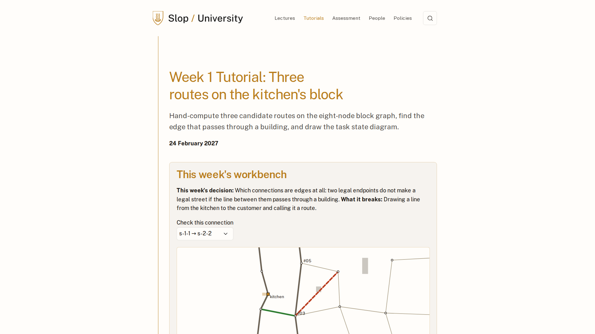
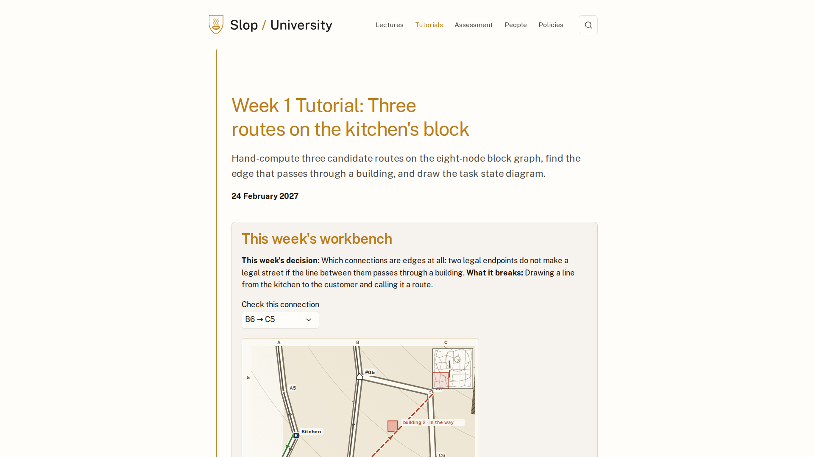

# Process overview

## What I built

A course site for SLOP3969, *Twenty Dinners, One Hill*: one ghost kitchen at the foot of a
hill, one evening, twenty orders, five drones, two charging pads and a corridor that fits one
drone at a time. Twelve weeks take a route finder and turn it into a planner that schedules
all twenty. Every tutorial page carries a workbench that computes in the browser on the same
data, the lab lets a reader make plans by hand and design scenarios of their own, and every
number on the site comes from the engine, never from a picture.

## How I got here

I wrote the rules before any code. `CLAUDE.md` carries the working rules from assignment 1
and drops that project's content: one decision per commit, stop at the first red check,
design decisions are mine, canonical data is not edited without asking
([`fcdbd5c`](https://github.com/comp4020-agentic-coding-studio/comp4020-ass2-1181278174/commit/fcdbd5c)).
The instruction that shaped the commit history was this one, verbatim:

> 赞同一个决定一个提交，你的提交不要带 Claude 署名，简短一些，讲清楚本次主要做的内容就行，按照我自己（学生）的口吻来

(one decision per commit, no agent attribution, short, in my own voice). The design went
into `docs/` as six English files with no history in them; the Chinese drafts stayed outside
the repo, and `CLAUDE.md` points at the files instead of restating them
([`ec880b0`](https://github.com/comp4020-agentic-coding-studio/comp4020-ass2-1181278174/commit/ec880b0),
[`45a6c46`](https://github.com/comp4020-agentic-coding-studio/comp4020-ass2-1181278174/commit/45a6c46)).

Two of my own plans were thrown away before that. Both introduced too many ideas and taught
none of them deeply. I audited a plan built around five upgrades of one problem, kept its
spine and rewrote the rest; the site is that spine.

The data was calibrated, not invented. The first probe showed that no order on the map had
more than one round-trip candidate, so the week-4 phenomenon (the fastest route cannot bring
the drone home) could not happen. I did not adjust a number; I changed the energy model so
that a steep climb costs more per metre than a gentle one, gave the hilltop a track and a
spiral, searched for a parameter set, and pinned the result by hash in `spec/`
([`625e608`](https://github.com/comp4020-agentic-coding-studio/comp4020-ass2-1181278174/commit/625e608),
[`010d96a`](https://github.com/comp4020-agentic-coding-studio/comp4020-ass2-1181278174/commit/010d96a)).

Every new test was shown failing first, and twice the failure was the test's. The stale-entry
search test went red because the example's last edge was too cheap for a stale entry ever to
surface; the engine was right and the fixture changed
([`cdd89b0`](https://github.com/comp4020-agentic-coding-studio/comp4020-ass2-1181278174/commit/cdd89b0)).
The first twenty-order run under the corridor left #07 unscheduled: the space-time planner
spent the return's energy on the outbound leg, week 4's lesson one layer up. The fix reserves
the cheapest return before the outbound leg is planned
([`360b46f`](https://github.com/comp4020-agentic-coding-studio/comp4020-ass2-1181278174/commit/360b46f)).

One design decision came from a check rather than a plan. A sixth navigation item wrapped the
theme's search icon onto a second row at 1920, so the lab stays off the header and is reached
from a card and from every workbench
([`cac27a1`](https://github.com/comp4020-agentic-coding-studio/comp4020-ass2-1181278174/commit/cac27a1)).

Then I reviewed my own site as a marker would and found two things wrong. The map read as a
random mesh: grid ids like `s-1-1` in every table, buildings as scattered boxes, the ridge
invisible. The two options were to redraw it or to regenerate a tidier map and redo the
calibration, the hashes and every number on the site. I chose to redraw only, with the data
untouched
([`75089d8`](https://github.com/comp4020-agentic-coding-studio/comp4020-ass2-1181278174/commit/75089d8)).

The lab was twelve preset instances under a slider: a demonstration, not the workbench the
design promised. I had it build the first two levels of freedom the design names, plans made
by hand on three weeks and a scenario panel, all through the same engine and validator
([`411bd37`](https://github.com/comp4020-agentic-coding-studio/comp4020-ass2-1181278174/commit/411bd37),
[`418675e`](https://github.com/comp4020-agentic-coding-studio/comp4020-ass2-1181278174/commit/418675e)).
The instruction was one line:

> 开始问题1 A 问题2 实验室先做到第二层

(start: option A for the map, the lab up to level two). Describing the map in words cost me
two rounds; the lab took a three-level table before the agent and I meant the same thing.

How I know it works: `pnpm check` before every commit (113 tests, the build's axe and link
checks on 37 pages); screenshots at 1920 and 390 from a Linux Chromium whose viewport a probe
page verifies first; deep-link screenshots that prove the browser recomputed rather than
showed the built HTML. What I did not verify by hand is a person clicking the editors in a
real browser; the tests drive them through the same code path.
