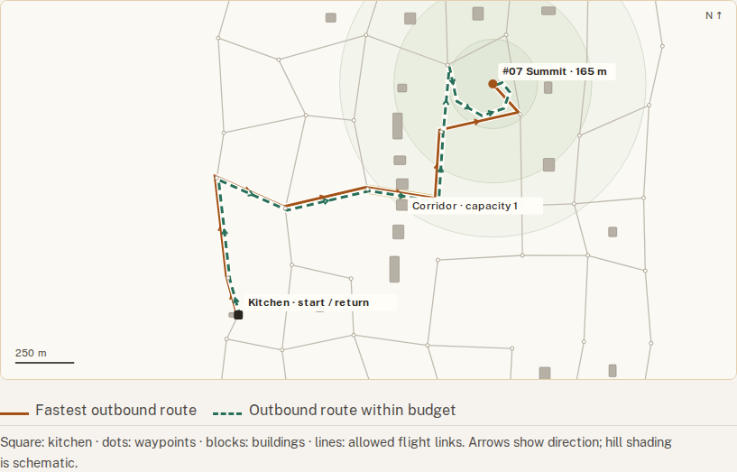
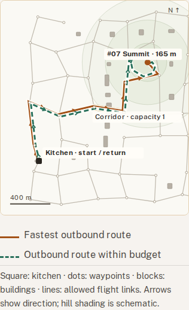
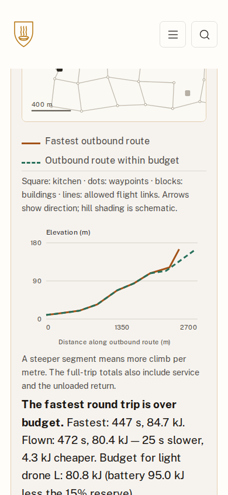
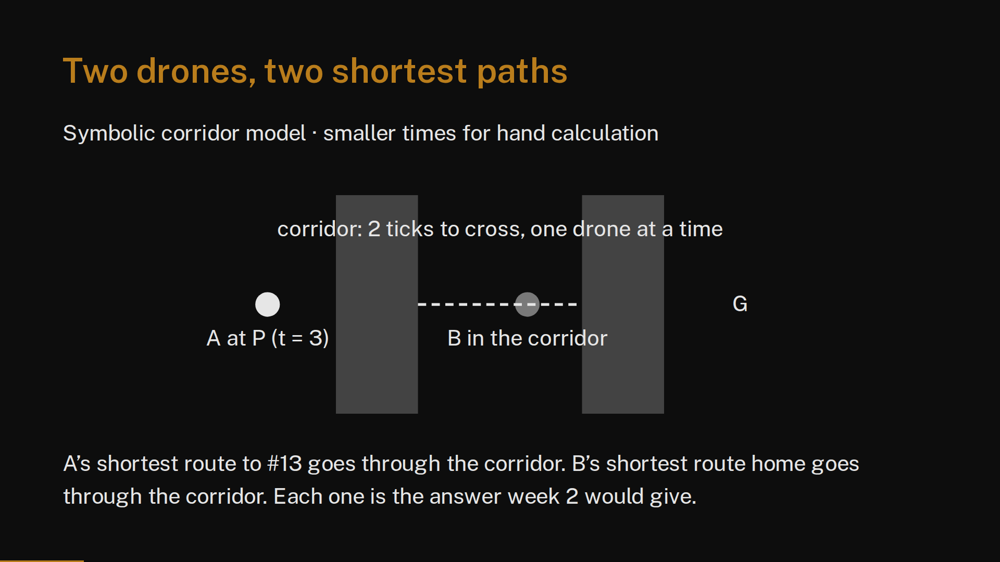

# Improvement verification — 20 September 2026

## Delivered

The owner requested the written plan and implementation after the tutorial and map review.
The plan is in `improvement-plan.md`; the implementation is on the existing `codex/ass2`
branch. No canonical data, data hash, course configuration, assessment weight or due date
changed. The changes are local; there was no push, deployment or visibility change.

- Correct arrival-order charging, with a regression first observed failing and then passing.
- Weekly URL state, state-carrying Lab links, and a selected-week Lab without stacked panels.
- Responsive map labels, endpoints, route arrows and legends; W4 route focus and height
  profiles; W1 block-only routes and blocked-building annotation; readable W9 occupancy lanes.
- Distinct experiment prompts for all twelve weeks, browser-local notes, saved baseline,
  comparison and JSON export. W5/W6 also accept a learner's six-order permutation.
- An isolated custom heuristic runner with a one-second limit, finite non-negative output
  checking and no HTML accepted from the Worker. Errors and timeouts report no result.
- Five-stage course navigation, adjacent-week links, worked lecture checkpoints, downloadable
  canonical data and full reference output, and assignment practice guidance.
- Accurate W5/W6 claims, stated resource-validator scope, and corrected SVG attributes and
  symbolic-model labels in the W9 deck.

## Commands and results

- `pnpm check`: 37 built pages; type checks passed; no link, automated accessibility or
  deck-structure violations; 10 test files and 96 tests passed.
- `pnpm exec vitest run spec/engine/fleet.test.ts -t 'serves pad requests'`: failed before
  the charging fix with `expected 6299 to be greater than or equal to 6628`; passed after it.
- Practice download verification: all four scenario objects match their canonical JSON;
  reference output is complete with 20 deliveries on time.
- `pnpm check:evidence`: passed; all five cited commits resolve and no assignment reflection is required.
- `git diff --check`: passed. Canonical inputs and their hash tests have no changes.

## Browser verification

36 regular pages were loaded at both 1920×1080 and 390×844, for 72 page/viewport checks.
No whole-document horizontal overflow or default runtime exception was observed. Map labels
were measured at at least 10.93 screen pixels; the previous W4/W9 phone labels were below
8 pixels. Detailed tables remain independently scrollable. The home page is now 4386 px
high on desktop and 6297 px on phone, compared with 6742 and 10550 in the review.

The targeted checks all passed:

- W4 link carries settings.
- W4 state survives opening Lab.
- Lab displays exactly the selected week.
- W2/W3 states are independent after reload.
- W3 displayed heuristic matches zero.
- Manual sequence is evaluated.
- Saved baseline differs from current run.
- Export includes notes, baseline and current configuration.
- Notes persist between tutorial and Lab.
- Custom heuristic syntax error.
- Custom heuristic timeout.
- Custom heuristic non-numeric.
- Custom heuristic invalid worker response.
- Custom heuristic valid function.
- Malformed settings fall back visibly.
- Readable map labels.
- No page overflow.
- No default runtime errors.

## Visual evidence

## Scope and limits

This is a local Chrome verification, not a live-site audit or an exhaustive screen-reader
review. No WebGL or animated flight replay was added. Hill shading is schematic; route
coordinates and profile values come from the canonical map. The interval validator does
not independently validate arbitrary imported flight geometry, payload or energy; the
practice guide makes the distinction explicit. Exported experiments are local evidence,
not received submissions. Stored reference assignments are re-evaluated under the corrected
engine; historical metrics in the untouched data file are provenance only.

All fixes belong to the approved improvement plan. The additional findings handled during
verification were the Lab router race, historic migration metrics and the W1 route camera
exposing routes outside its intended block. These are recorded in `moments.md`.
